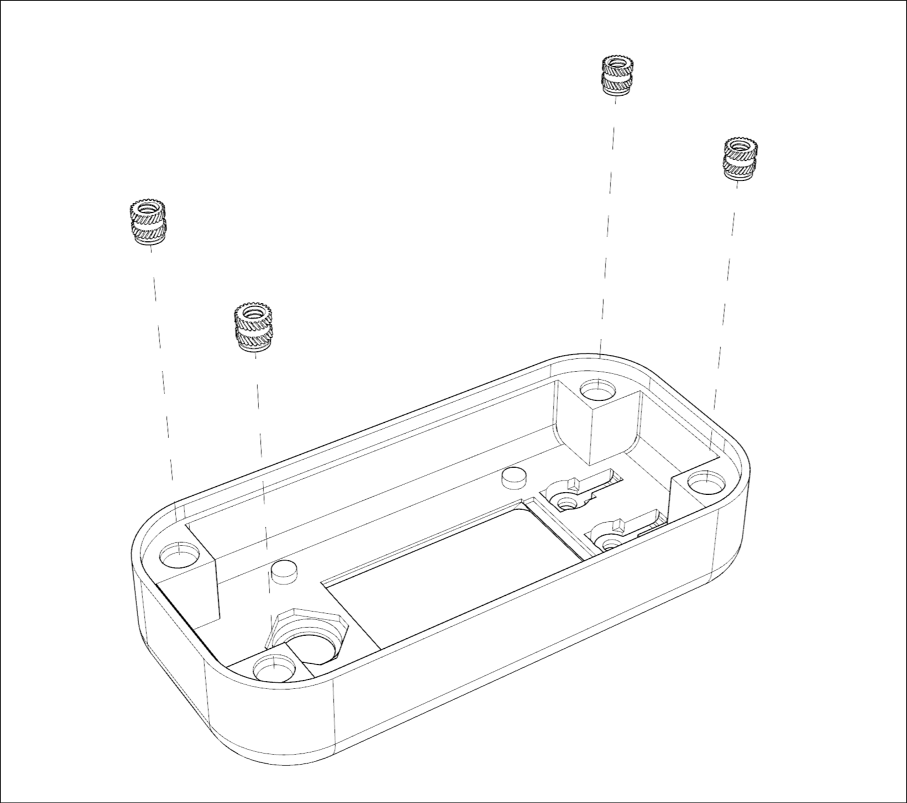
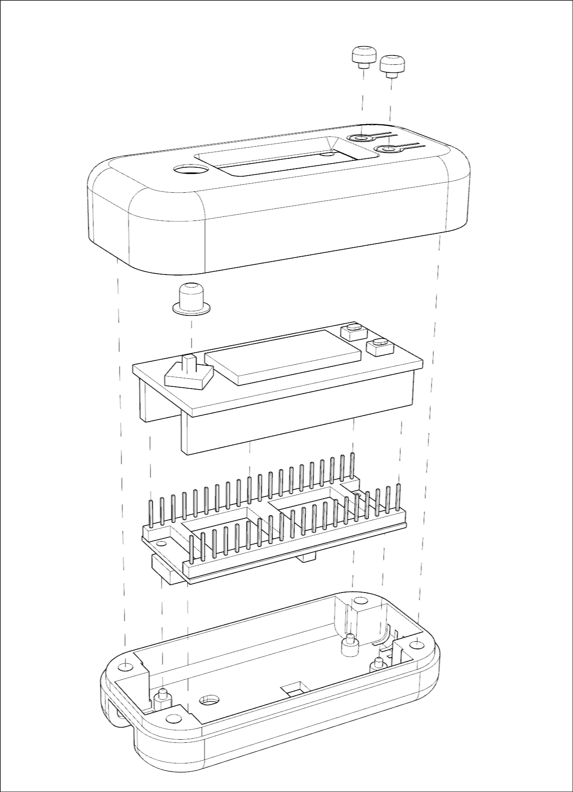

# Habit Tracker

# About

Track and update your habits stored in Pixela graph using Raspberry Pico 2W.

This project has been created as a part of `introduction to working with Pico` workshop.
Device built with Pico 2W and Waveshare 0.96" screen.
Uses [Pixela](https://pixe.la/) as an online data storage.

# Known limitations

The code is not meant to be pretty - and definitely needs improvement.
It was created with having a clean `main.py` file in mind - workshop participants
during one of the stages try to come up with steps needed to fulfill the task
and we compare it with provided code, not getting into details how some of the
functions / classes implement needed functionality.

The code is meant as an inspiration and a starting point. At the end of the lab
the educator shares some of the ideas how the code can be improved / extended.

Currently ui messages are hardcoded in Polish - but they are easy to find and change
(it is extremely simple device). At one point I may introduce some multilingual capabilities.

# Requirements

## Hardware

- [Raspberry Pi Pico 2W](https://www.raspberrypi.com/documentation/microcontrollers/pico-series.html)
- USB cable to program the Raspberry Pi Pico
- [Waveshare 0.96" inch display for Pico](https://www.waveshare.com/wiki/Pico-LCD-0.96)

- 3d printed [case_step](./case_step) directory contains archive with models
  for the case.

- 4x short M3 heat inserts (external diameter 4.2mm)

- 4x 12mm M3 screws.

## Software

- editor wit MicroPython support is strongly recommended

- fill in [src/.pixela](./src/.pixela) file with Pixela account / graph settings

- fill in [src/.WiFi](./src/.WiFi) with WiFi details (SSID and password).

- download sample project for [Waveshare screen](https://files.waveshare.com/wiki/common/Pico_code.7z),
  the code for managing the screen from the extracted archive should be saved as `src/LCD_0inch96.py`.

# Assembly

- 3d print the case
- mount heated inserts into the holes in the top part of the case
- glue the smaller buttons to the top part of the case
- put screen and pico together and place it in the bottom part of the case
- place joystick button cap on the joystick
- place top part of the case and use M3 screws to screw assembly together

If the pico with screen is a bit too loose you could add some tape on the feet,
which push the screen towards the pico (on the top part of the case).

# Uploading software

- TODO

# Usage

Power on your device, wait until it connects to the WiFi.

After completing some task you wish to track via Pixela service,
click the bottom right button, so that the device will send the data to Pixela.
As a result the colored square will appear to mark your progress.

Use the joystick to check details of your progress in the past 5 days.

# What next?

The device was meant to be a part of the introductory workshop - it is
far from ideal, it leaves some room for tweaking.

Some ideas:

- Don't like the colors of the squares? Change them.
  Check [src/colorsets.py](./src/colorsets.py) file - it contains some example
  colors ets and a function, which allows converting regular RGB (888)
  to the color format required by the screen

- Notice that errors trigger a message on the screen.
  You need to power off and then power on the device to reset it.
  It can be improved - map a key so it would trigger a reset.

- The device sometimes won't be able to update Pixala graph.
  That's because free pixela drops around 25% of requests.
  Function that gets data from the service has the 5 retries added,
  but the one that adds progress (sends data to pixela) does not.
  Try to fix that.
